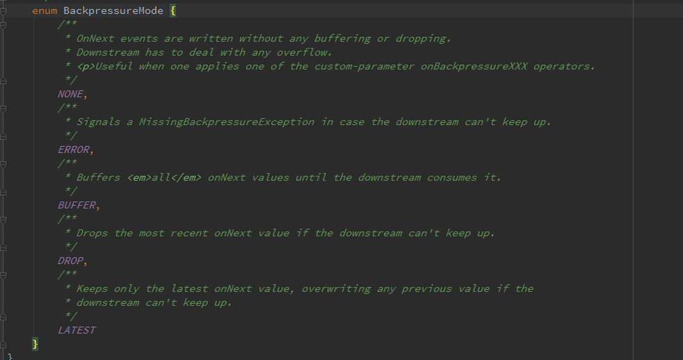

# Flowable

# 简介
Flowable是RxJava2.x中新增的类，专门用于应对背压（Backpressure）问题，但这并不是RxJava2.x中新引入的概念。所谓背压，即生产者的速度大于消费者的速度带来的问题，比如在Android中常见的点击事件，点击过快则会造成点击两次的效果。 
我们知道，在RxJava1.x中背压控制是由Observable完成的，使用如下：

```
 Observable.range(1,10000)
            .onBackpressureDrop()
            .subscribe(integer -> Log.d("JG",integer.toString()));
```

而在RxJava2.x中将其独立了出来，取名为Flowable。因此，原先的Observable已经不具备背压处理能力。 
通过Flowable我们可以自定义背压处理策略。 

测试Flowable例子如下：

```
Flowable.create(new FlowableOnSubscribe<Integer>() {
 
            @Override
            public void subscribe(FlowableEmitter<Integer> e) throws Exception {
 
                for(int i=0;i<10000;i++){
                    e.onNext(i);
                }
                e.onComplete();
            }
        }, FlowableEmitter.BackpressureMode.ERROR) //指定背压处理策略，抛出异常
                .subscribeOn(Schedulers.computation())
                .observeOn(Schedulers.newThread())
                .subscribe(new Consumer<Integer>() {
                    @Override
                    public void accept(Integer integer) throws Exception {
                        Log.d("JG", integer.toString());
                        Thread.sleep(1000);
                    }
                }, new Consumer<Throwable>() {
                    @Override
                    public void accept(Throwable throwable) throws Exception {
                        Log.d("JG",throwable.toString());
                    }
                });
```


或者可以使用类似RxJava1.x的方式来控制。

```
  Flowable.range(1,10000)
                .onBackpressureDrop()
                .subscribe(integer -> Log.d("JG",integer.toString()));

```

其中还需要注意的一点在于，Flowable并不是订阅就开始发送数据，而是需等到执行Subscription#request才能开始发送数据。当然，使用简化subscribe订阅方法会默认指定Long.MAX_VALUE。手动指定的例子如下：

```
Flowable.range(1,10).subscribe(new Subscriber<Integer>() {
            @Override
            public void onSubscribe(Subscription s) {
                s.request(Long.MAX_VALUE);//设置请求数
            }
 
            @Override
            public void onNext(Integer integer) {
 
            }
 
            @Override
            public void onError(Throwable t) {
 
            }
 
            @Override
            public void onComplete() {
 
            }
        });
```


# 参考
>* http://www.jcodecraeer.com/a/anzhuokaifa/androidkaifa/2016/0907/6604.html